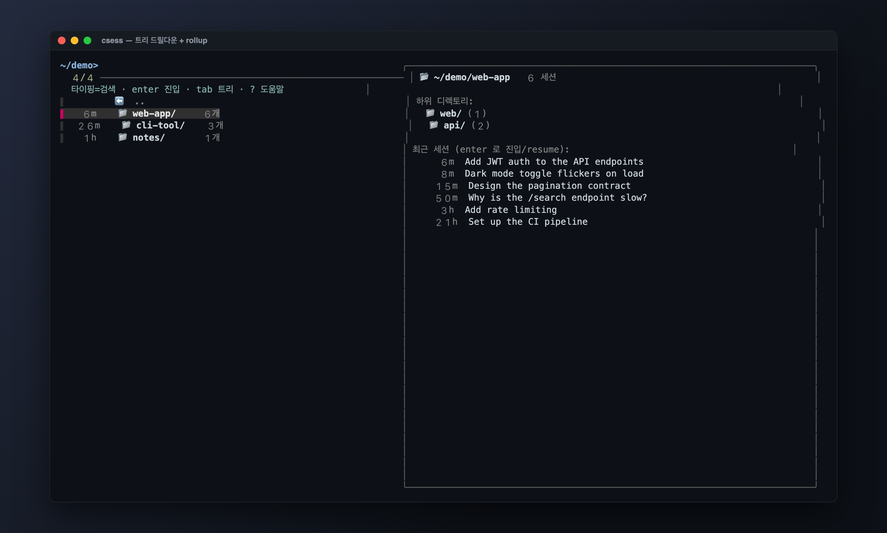
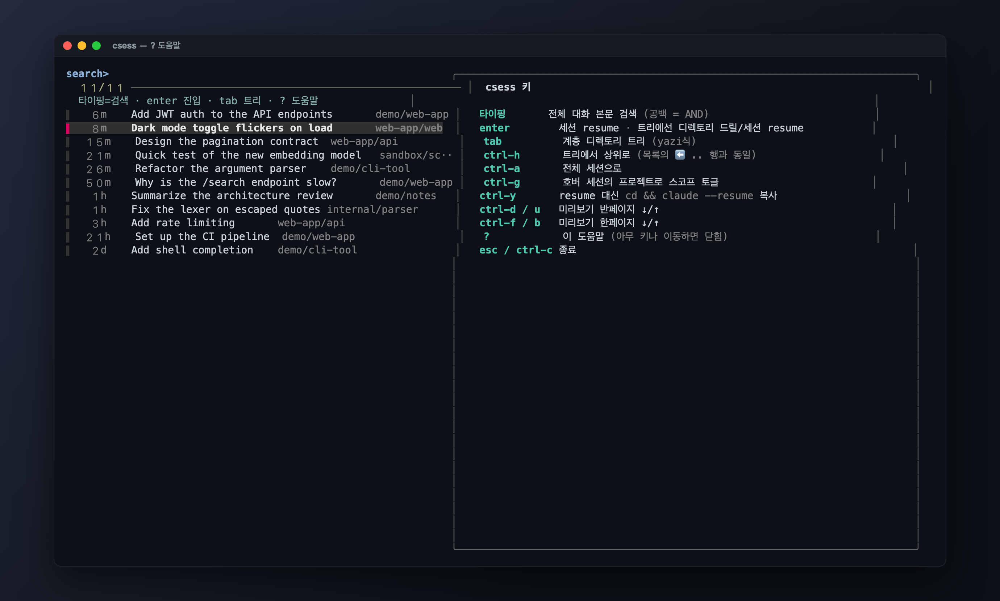

# csess

> Claude Code 세션을 **대화 본문으로 검색**하고 **엔터 한 번에 그 자리에서 resume** 하는 터미널 런처.


`claude --resume` 은 **현재 디렉토리의 세션만**, 그것도 내용 검색 없이 보여준다. `csess` 는
`~/.claude/projects` 에 흩어진 모든 세션을 한 화면에 모아 — 파일명이 아니라 **대화 내용**으로 찾고,
고르면 올바른 작업 디렉토리로 `cd` 한 뒤 바로 그 세션을 잇는다.

> _스크린샷은 데모 데이터입니다._

## 왜

- **내용으로 찾는다** — 경로/파일명이 아니라 대화 안의 말로. _"그때 그 에러 어느 세션에서 물어봤더라?"_
- **크로스 프로젝트** — 수십 개 디렉토리에 흩어진 세션을 한 곳에서. `claude --resume` 이 못 하는 것.
- **엔터 한 번에 점프** — cd·복사·붙여넣기 없이 그 터미널에 바로 뜬다 (`exec claude --resume`).

## 기능

### 본문 전체 검색 (공백 = AND)

타이핑하면 fzf 가 아니라 **`ripgrep` 이 전체 대화 본문을** 즉시 검색한다. 공백으로 나누면 AND —
`auth jwt` 처럼 2~3 단어면 정밀하게 좁혀진다.


### 예쁜 미리보기

선택한 세션의 대화를 **마크다운 + 코드 구문 하이라이트**로 렌더한다 (`bat`). 역할은 색으로 구분
(`▌ 나` / `▌ Claude`). `ctrl-d`/`ctrl-u` 로 스크롤. (툴 호출·thinking 블록은 생략하고 사람·모델의 글만.)

### 계층 디렉토리 트리 — `tab` (yazi식)

`tab` 으로 프로젝트를 트리처럼 탐색한다. **세션 cwd 로만 트리를 치고**(디스크 스캔 없음),
단일 체인은 **경로 압축**(`sandbox/scratch`), 부모 노드엔 **rollup 카운트**가 붙는다.


`enter` 로 드릴다운, `ctrl-h` 또는 `⬅ ..` 행으로 상위. 한 레벨에 하위 폴더와 그 자리 세션이 함께 뜬다.



### 도움말 — `?`

전체 키 레퍼런스를 미리보기 패인에 띄운다 (아무 키로 이동하면 닫힘).



## 요구사항

| 도구 | 용도 | 필수 |
|------|------|:---:|
| [`fzf`](https://github.com/junegunn/fzf) | TUI (0.36+ 권장, 개발·검증은 0.70) | ✅ |
| [`jq`](https://github.com/jqlang/jq) | JSONL 파싱 | ✅ |
| [`ripgrep`](https://github.com/BurntSushi/ripgrep) (`rg`) | 본문 검색 (없으면 `grep` 폴백) | 권장 |
| [`bat`](https://github.com/sharkdp/bat) | 미리보기 마크다운/코드 색칠 (없으면 plain) | 선택 |
| `claude` CLI | `--resume` 실행 | ✅ |

> Phase A 는 `stat -f`·`pbcopy` 등 BSD 유틸에 의존하므로 **macOS** 기준이다.

## 설치

단일 셸 스크립트다. PATH 에 심볼릭 링크하거나 alias 를 건다.

```sh
git clone <repo> csess && cd csess
ln -s "$PWD/bin/csess" ~/bin/csess      # ~/bin 이 PATH 에 있으면
# 또는
echo "alias csess='$PWD/bin/csess'" >> ~/.zshrc
```

## 사용

```sh
csess            # 세션 목록 → 타이핑으로 본문 검색 → enter 로 resume
csess --copy     # enter 시 exec 대신 'cd .. && claude --resume ..' 를 클립보드 복사
csess -h         # 도움말
```

### 키

| 키 | 동작 |
|------|------|
| _(타이핑)_ | 전체 대화 본문 검색 (공백 = AND) |
| `enter` | 세션 resume · 트리에선 디렉토리 드릴 / 세션 resume |
| `tab` | 계층 디렉토리 트리 (yazi식) |
| `ctrl-h` | 트리에서 상위로 (목록의 `⬅ ..` 행과 동일) |
| `ctrl-a` | 전체 세션으로 |
| `ctrl-g` | 호버 세션의 프로젝트로 스코프 토글 |
| `ctrl-y` | resume 대신 `cd && claude --resume` 명령 복사 |
| `ctrl-d` / `ctrl-u` | 미리보기 반페이지 ↓/↑ |
| `ctrl-f` / `ctrl-b` | 미리보기 한페이지 ↓/↑ |
| `?` | 전체 키 도움말 |
| `esc` / `ctrl-c` | 종료 |

### 환경변수

| 변수 | 설명 |
|------|------|
| `CSESS_CLAUDE_ROOT` | projects 루트 (기본 `~/.claude/projects`) |
| `CSESS_PREVIEW_BYTES` | 미리보기가 파싱할 입력 바이트 상한 (기본 `500000`; 낮추면 스크롤 더 가벼움) |
| `CSESS_NO_BAT` | 미리보기 색칠에 `bat` 미사용 (plain) |
| `CSESS_DRY_RUN` | resume 를 exec 하지 않고 명령만 출력 |

## 동작 방식 (간단히)

- **매 실행 fresh 빌드 (캐시 없음).** `find ~/.claude/projects -mindepth 2 -maxdepth 2 -name '*.jsonl'`
  를 `xargs -P8` 로 병렬 파싱. **depth-2 가 곧 서브에이전트 필터**(resume 불가한 `*/subagents/*` 제외).
- **cwd 는 JSONL 내용에서 읽는다.** 디렉토리명 디코딩은 lossy → cwd 불명이면 표시만 하고 **resume 은 거부**(안전).
- **검색은 rg 가, fzf 가 아니라.** `fzf --disabled` + `change:reload` 로 키 입력마다 본문을 rg 로 검색.
- **미리보기는 한 패스** — `jq`(텍스트 턴 추출) → `bat`(마크다운/코드 색칠) → `awk`(역할 헤더).
- **resume = `cd "$cwd" && exec claude --resume "$id"`.** `--resume` 은 cwd-스코프라 `cd` 는 안전이 아니라 **정확성** 필수.

전체 설계와 결정 근거는 **[docs/DESIGN.md](docs/DESIGN.md)** 에 있다.

## 로드맵

- **Phase A — 현재.** 셸 + `fzf` + `jq`. Claude 전용. 매일 쓰며 데이터 스키마·미리보기 포맷·exec 로직을 굳힌다.
- **Phase B.** Rust(`ratatui` + `nucleo`) 단일 바이너리. **인프로세스 렌더로 스크롤 CPU 제거**, SQLite 인덱스,
  그리고 **Codex 합류**(`codex resume`).

## 한계

- 개인용 빌더 도구. 현재 **macOS · Claude 전용**.
- raw JSONL 검색이라 흔한 단어는 노이즈가 많다 — 다중어로 좁히면 정밀.
- 캐시 없는 매-실행 모델이라 스크롤 시 미리보기 재렌더 비용이 있다(거대 세션은 `CSESS_PREVIEW_BYTES` 로 완화).
  근본 해결은 Phase B(인프로세스 렌더 + 인덱스).
