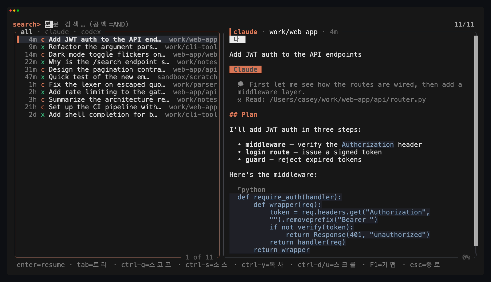
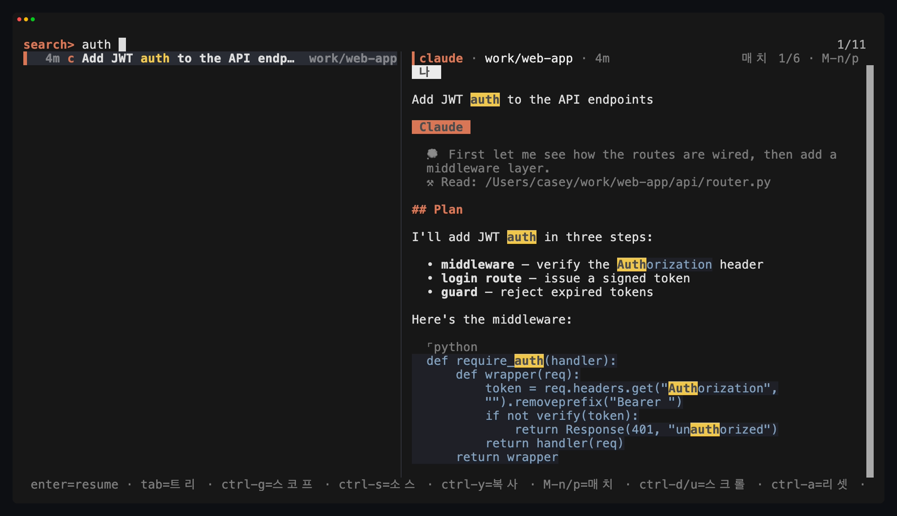
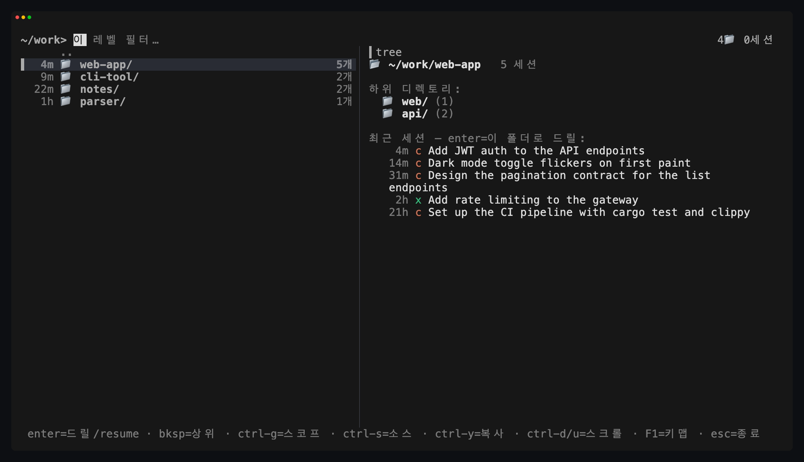
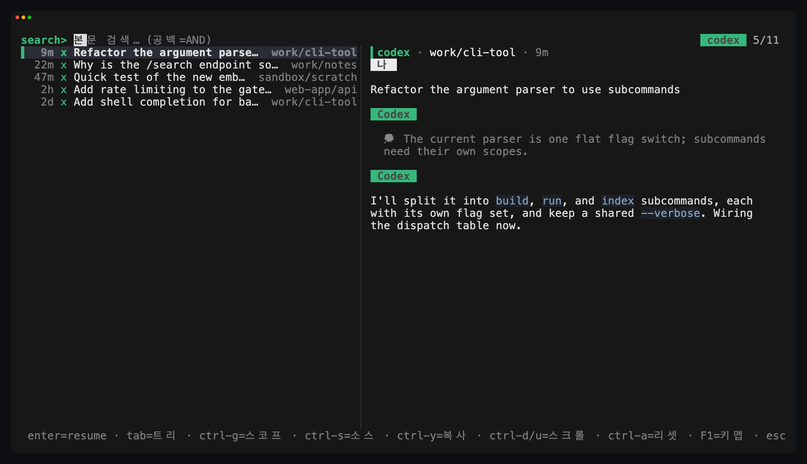

# csess

Claude Code / Codex 세션을 **대화 내용으로 검색**하고 엔터 한 번에 그 자리에서 이어가는 터미널 TUI. Rust 단일 바이너리.



`claude --resume` 은 현재 디렉토리의 세션만, 그것도 내용 검색 없이 보여준다. `csess` 는 `~/.claude/projects` 와 `~/.codex/sessions` 에 흩어진 **모든 세션을 한 화면에** 모아 — 파일명이 아니라 **대화 안의 말**로 찾고, 고르면 올바른 작업 디렉토리로 `cd` 한 뒤 그 세션을 resume 한다. Claude 는 주황 `c`, Codex 는 그린 `x` 로 구분.

## 설치

```sh
git clone https://github.com/sml1323/csess.git && cd csess
cargo install --path .          # ~/.cargo/bin/csess 로 설치 (PATH 에 있으면 바로 csess)
```

직접 개발하며 쓸 거면 심링크가 편하다 — 다시 빌드하면 자동 반영된다:

```sh
cargo build --release
ln -sf "$PWD/target/release/csess" ~/.local/bin/csess   # PATH 에 있는 디렉토리면 아무거나
```

resume 하려면 해당 `claude` / `codex` CLI 가 있어야 한다. macOS 기준으로 검증했다.

## 사용

```sh
csess              # TUI (기본): 타이핑으로 본문 검색 → enter 로 resume
csess --refresh    # SQLite 캐시 증분 갱신
csess --index      # Claude 세션 전체를 TSV 로 (디버그)
csess -h           # 도움말
```

타이핑하면 추출된 대화 본문(제목+내용)을 substring 검색한다 — 공백으로 나누면 AND(`auth jwt`). 미리보기는 맨 위가 아니라 **첫 매치 지점으로 자동 이동**하고 매치 단어를 강조해, 왜 이 세션이 걸렸는지 바로 보인다. `alt-n`/`alt-p` 로 매치 간 이동. `tab` 으로 디렉토리 트리, `ctrl-s` 로 소스 필터, `ctrl-g` 로 프로젝트 스코프.

| 본문 검색 (공백 = AND) | 계층 트리 (`tab`) | 소스 필터 (`ctrl-s`) |
|:---:|:---:|:---:|
|  |  |  |

### 키

전체 키맵은 TUI 안에서 `F1`(또는 `alt-h`)로 볼 수 있다.

| 키 | 동작 |
|------|------|
| _(타이핑)_ | 본문 검색 (공백 = AND) · 미리보기는 첫 매치로 점프 + 매치 강조(리스트 제목도) · 트리에선 라벨/제목 필터 |
| `enter` | 세션 resume · 트리에선 디렉토리 드릴 / 세션 resume |
| `↑`/`↓` · `ctrl-p`/`ctrl-n` | 이동 (`PgUp`/`PgDn` 페이지 · `Home`/`End` 처음/끝) |
| `tab` · `ctrl-o` | 계층 디렉토리 트리 진입 |
| `ctrl-h` · `backspace`(빈 쿼리) | 트리에서 상위로 |
| `ctrl-g` | 호버 세션의 프로젝트로 스코프 토글 (검색어 유지) |
| `ctrl-s` | 소스 필터 순환 (전체 → Claude → Codex) — 활성 필터는 헤더 우측 필로 표시 |
| `ctrl-a` | 전체로 리셋 (스코프·필터·트리 해제) |
| `ctrl-y` | `cd && claude/codex resume` 명령 복사 (앱 유지, 푸터에 확인 표시) |
| `ctrl-w` · `alt-backspace` | 검색어 마지막 단어 삭제 |
| `ctrl-d` / `ctrl-u` | 미리보기 ↓/↑ 스크롤 (끝에서 멈춤, 우측 스크롤바) |
| `alt-n` / `alt-p` · `F3` | 다음/이전 검색 매치로 이동 — 미리보기 타이틀에 `매치 k/N` |
| `F1` · `alt-h` | 키맵 오버레이 |
| `esc` / `ctrl-c` | 종료 |

macOS 기본 터미널에서 `alt-*` 는 Option 을 Meta 로 설정해야 한다 (iTerm2: *Use Option as Meta*). 안 되면 `F3` 이 매치 이동을 대신한다.

### 환경변수

| 변수 | 설명 |
|------|------|
| `CSESS_CLAUDE_ROOT` | Claude projects 루트 (기본 `~/.claude/projects`) |
| `CSESS_CODEX_ROOT` | Codex sessions 루트 (기본 `~/.codex/sessions`) |
| `CSESS_DB` | SQLite 인덱스 경로 (기본 `~/.cache/csess/index.db`) |
| `CSESS_DRY_RUN` | resume 를 exec 하지 않고 명령만 출력 |

## 동작 방식

- **SQLite 증분 캐시** — `(path, mtime, size)` 가 그대로면 재파싱 스킵, 바뀐/새 파일만 파싱, 사라진 파일은 삭제.
- **인프로세스 렌더** — 미리보기·검색을 외부 프로세스 없이 처리해 스크롤이 가볍다. 툴 호출·thinking 은 접고 사람·모델의 글만.
- **cwd 는 JSONL 내용에서** 읽는다 — 디렉토리명 디코딩은 lossy. cwd 불명이면 표시만 하고 **resume 은 거부**.
- **resume = `cd "$cwd" && exec claude --resume <id>`** (Codex 는 `codex resume <uuid>`). `--resume` 은 cwd-스코프라 `cd` 는 정확성에 필수.

전체 설계와 결정 근거는 **[docs/DESIGN.md](docs/DESIGN.md)** 에 있다. 스크린샷은 `scripts/gen-demo.py` + `scripts/demo.tape`([VHS](https://github.com/charmbracelet/vhs))로 재현 가능한 데모 데이터에서 생성한다. (초기 셸 프로토타입은 `bin/csess` 에 남아 있다.)
